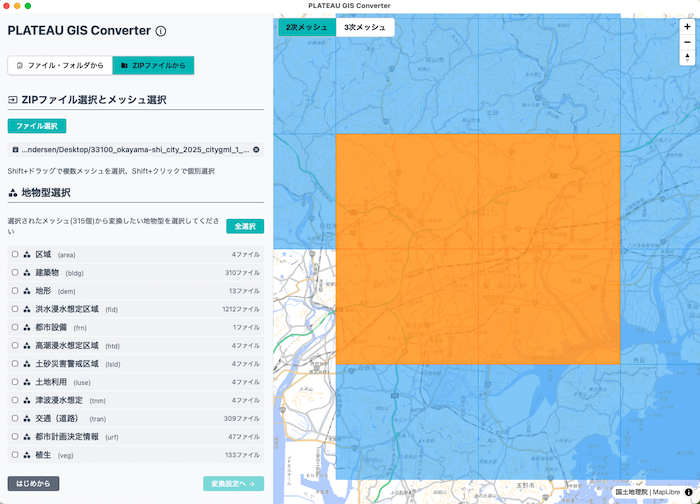
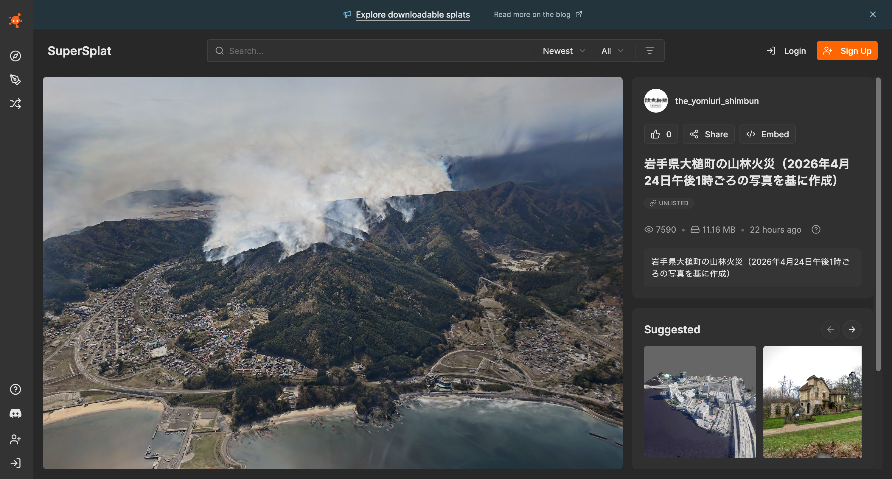

# 2026-05-01
## 2週間の作業サマリ
- 3DBAG：PDOKの仕様確認，3DBAG Viewer， GPKG data dumpによるサマリの確認
- i-URやPLATEAUデータを踏まえた属性項目の確認
    - azulでPLATEAUが読み込めない(ADEの問題が影響している)
- FOSS4G 2026Academic Trackの査読取りまとめ

## 今後の予定
- PLATEAUの全国サマリの集計
- CityJSON化する際のPLATEAU-ADEのミニマムな属性のピックアップ
- 2026-05-13にTomTomのMaptimeに招待を受けた（馬場さんと共に）

## Others
- 日本の大規模山林火災の3DMap
    - [Watanave Lab. at the Univ. Tokyo: Cesium3D](https://otsuchi.mapping.jp/index.html)
    - [Yomiuri Shinbun:Supersplat](https://www.yomiuri.co.jp/national/20260426-GYT1T00092/)

---

# PLATEAU-GIS-Converter
- [Github:ja](https://github.com/MIERUNE/plateau-gis-converter)

---

# 3D Map of Large-Scale Forest Fires in Otsuchi, Iwate, Japan
- [Yomiuri Shinbun:Supersplat](https://www.yomiuri.co.jp/national/20260426-GYT1T00092/)

