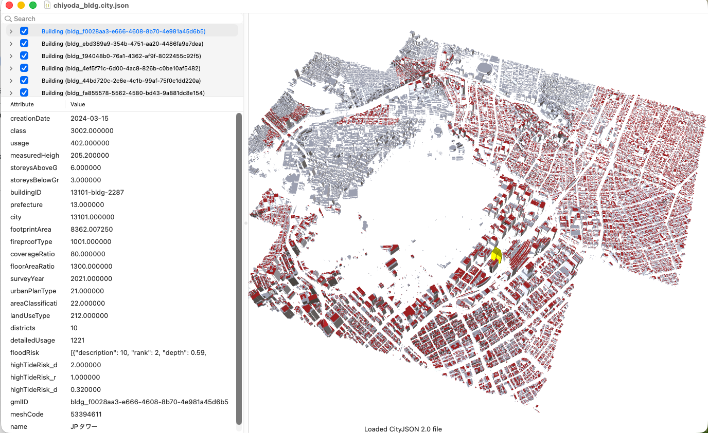
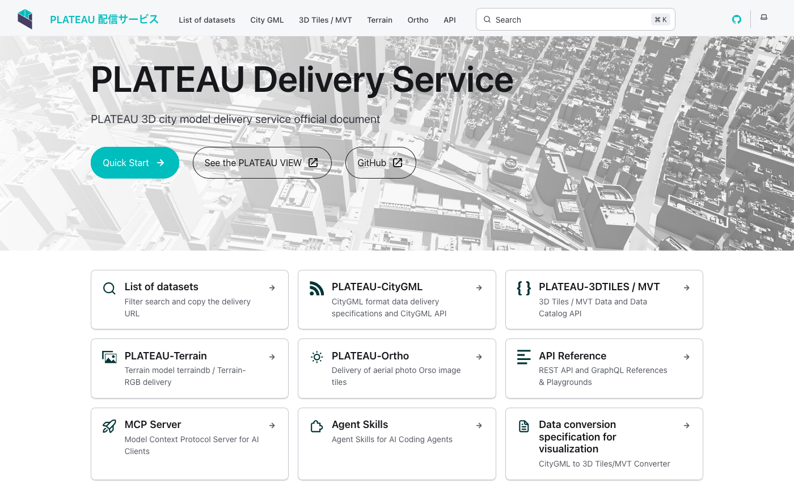

## 2026-05-18

### Summary of Works

- **Topic 1: plateau2cityjson**
- **Topic 2: 3D SDI Governance**
- Others
  - Maptime @ TomTom (with Hidemichi)
    - ~20 participants from the mapping industry
    - Insufficient detail of elevated and ancillary building structures
        - Potential improvement of **3DBAG wall models**.Possibly using external data sources(Oblique Photo, GoogleStreetView, Mapillary?)
- Preparation for **3DTea talk**

---

## Topic 1: PLATEAU → CityJSON

- Developed a Python script based on updated [specification proposal (2026-05-12)](https://tossetolab.github.io/TUDelft/publish/0428iUR-CityJSON-Building-Mapping.html)
- Conversion test:
  - Area: around Tokyo Station (1 ward)
- Validation:
  - Checked results using Azul, val3dity and QGIS
- Question:
  - How to share the code and specification?
    - Which GitHub repository is better

---

# plateu2cityjson
  - [CityGML to CityJSON 2026-05-12 updated](https://tossetolab.github.io/TUDelft/publish/0428iUR-CityJSON-Building-Mapping.html)
    - Output: 38,473 buildings (121.4 MB)
    - File: chiyoda_bldg.city.json
      

---

## PLATEAU Delivery Service (New!)
  - [Only Japanese Documentation](https://docs.plateauview.mlit.go.jp/)
  - REST API and MCP (Claude code) service

      

---

## Next Works

- **Topic 1 (continued)**
  - Listing latest all PLATEAU data categories & URL
  - Verification of data obtained via PLATEAU API [PLATEAU API/MCP service](https://docs.plateauview.mlit.go.jp/)
  

- **Topic 2 (continued)**
  - Ongoing discussions with Prof. Bastiaan (Next: 2026-06-08)
  - Explore recent SDI initiatives and sustainability models (e.g., INSPIRE)

---

## Others
- Preparation PLATEAU lecture (2026-06-03)
- Write FOSS4G academic paper (ISPRS Archives, Deadline:2026-06-15)
- Considering FOSS4G NL @ Groningen
  - Unable to attend Regional Study Conference @Sweden. Because outside the Netherlands, I couldn't complete my university procedures in time.
  
