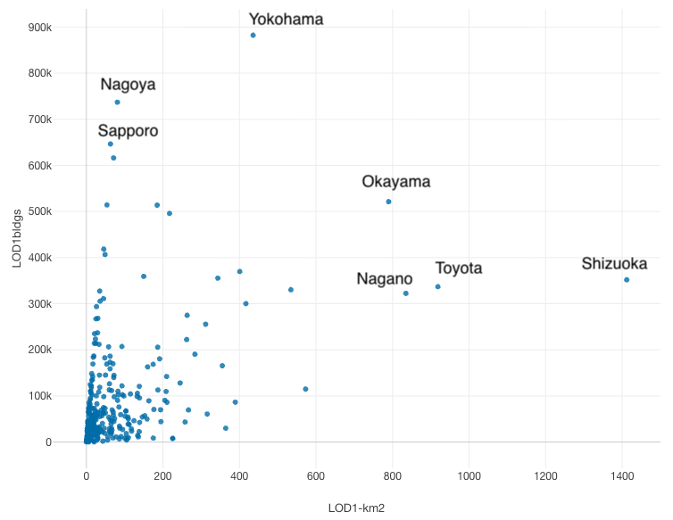

## 2026-06-01

### Summary of Works

- **Topic 1: plateau2cityjson** & **Topic 2: 3D SDI Governance**
  * Listing the latest PLATEAU-developed cities and data categories using PLATEAU-API and metadata

- Others (Next 2 slides)
  - a. 3DTea talk discussions
  - b. Meeting for collaboration possibility with TomTom (with Hidemichi)
  - (c. Preparation lecture for **PLATEAU overview@GEO1004**)
  - (d. A paper analyzing the 4-year trends of OSMCha in Japan)

---

## Others
- a. 3DTea talk discussions:
  - Which features will be converted to CityJSON?
    - While prioritizing buildings and roads, it would also be good to include elements relevant to the Japanese context (land use, hazards, vegetation) where data coverage is good.
  - More explanation of "complexities" of PLATEAU data.
  - 1. Even taking buildings as an example, there are a great many types of uro: Extended properties.
  - 2. Since the i-UR specifications include zone data, such as Statistical Grid Data, it is necessary to clarify the minimum required direct attribute values for buildings.

---

## Others
- b. Meeting for TomTom (with Hidemichi)
  - A proposal was made for "TomTom Day" at TUDelft as a platform for introducing each other's projects, with a view to future collaboration between our group and TomTom.
  - TomTom places great importance on further community building within the entire mapping industry and wants to actively collaborate not only with Maptime, but also with students and researchers.
    - Hidemichi introduced the possibility of lunchtime seminars, and also introduced the student-led organization [GEOS](https://www.geostudelft.nl/).
    - They acknowledged that Stelios is a colleague and said they would try to contact him.

---

## Topic 1 & Topic 2

- Listing the latest PLATEAU-developed cities and data categories
  - The coverage was achieved for **304 / 1741 cities (27.6 million buildings by LOD1)**.
  - LOD2,3 were confirmed in 246 cities, but only in very limited areas, such as in front of stations.
  - The exact number of buildings in Japan is unknown, but statistically estimated to be about **65 million buildings**.
  - [Excel-based list](./research/PLATEAU-Summary-202603.xlsx)
 

---

## Next Works

- **Topic 1**
	-  (tentative) Calculating the PLATEAU summary file and access-log
  -  (tentative) Test conversion CityJSON for other cities
- **Topic 2**
  - Ongoing discussions with Prof. Bastiaan (2026-06-08)
  - MLIT meeting for future roadmaps of project PLATEAU and TUDelft's activities (2026-06-05)
