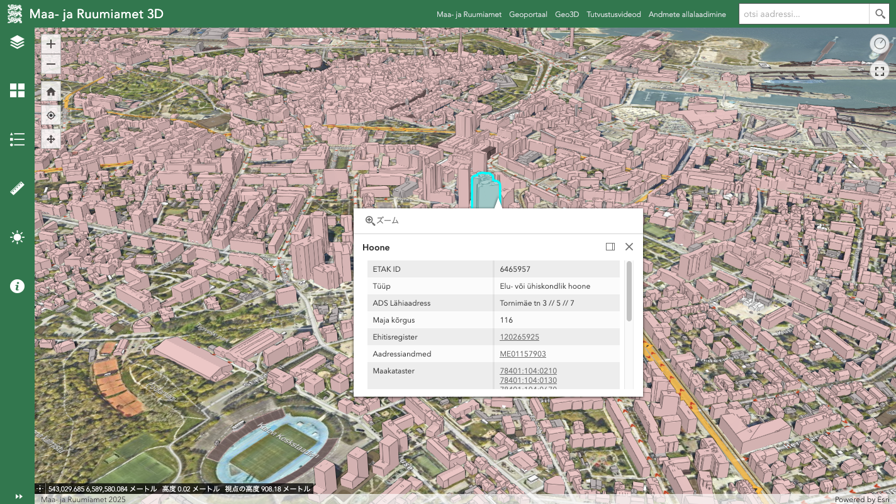

## 2026-07-02

### Summary of Works

- **Topic 2: 3D SDI Governance**
  - Discussing the structure of a writing paper on governance with Bastiaan.
    - Review of previous research and JRC reports for data space
  - Discussion with Peter van Oosterom regarding BIM data, ISO 19152(LADM) and Point cloud.
  - participate EuroSDR 3D-GIS for NMCAs online-seminar
    - [Use cases in Estonia](https://3d.maaruum.ee/kaart/)

- Others
  - a. visit to the TUDelft Library's collection of antique maps and a meeting with the technical staff (Jules Schoonman)
    - [Allmaps](https://allmaps.org/) project with Martijn Meijers
  - b. [CNG London](https://cloudnativegeo.org/events/cng-london/) related to weather observation and remote sensing analysis.
    - [GeoAI UK](https://iuk-business-connect.org.uk/wp-content/uploads/2026/04/GeoAI-UK-Outlook-Report-Innovate-UK-Business-Connect-April-2026.pdf)
  - c. Visit to UCL-CASA with [Chen Zhong](https://profiles.ucl.ac.uk/46973-chen-zhong) and Pang Yanbo

---

## Topic 2: 3D-SDI governance

- There is potential for two papers:
  - **1) a comparative study of 3D-GIS data from NL (+EU) and Japan**
    - From the early SDI research discussed by Masser et al. in the 2000s, to a vision for 3D-SDI towards the future around 2030.
    - The biggest changes in 3D-SDI are the **volume of data (and methods of delivery) and the diversity of stakeholders**.
      - from the GAME and FILM sector?
  - **2) development of a 3D SDI assessment framework**
    - Reviewing previous SDI assessments, this paper explores related new technological 3D developments, and how to evaluate the current state of 3D-SDI, particularly its maturity and performance.
    - (PLATEAU) data access, volume, variety(format), development via GitHub etc...

---
## 3D-SDI framework

---

## Discussion with Peter van Oosterom regarding BIM data and ISO 19152.
- **Digital Triplet concept:** Integration of physical models (e.g., BIM), legal/administrative data, and real-time updates to represent and manage both physical and legal spaces

- Implementation of a standardized legal data model based on ISO 19152 (LADM), enabling consistent representation and integration of ownership, rights, and spatial units in 3D systems

- Use of point cloud data as a scalable alternative to BIM for 3D representation (e.g., 3DGS) of built environments

 

---

## Use cases in Estonia
- Development 3D viewer by ESRI
  - https://3d.maaruum.ee/kaart/
- [National 3D spatial data strategy (Geo3D)](https://geoportaal.maaamet.ee/eng/spatial-data/geo3d/geo3d-strategy-p835.html)
integrating data **data collection, modelling, sharing, and visualization**, with a roadmap 2026.
 

---

## Next Works

- **Topic 1**
	-  (tentative) Calculating the PLATEAU summary file and access-log
  -  (tentative) Test conversion CityJSON for other cities
- **Topic 2**
  - Ongoing discussion with Bastiaan (2026-07-08)
  - appointment & visit for Kadaster (with Bastiaan)
  - appointment & visit for Michel Grothe @ geonovum
- Others
  - participate FOSS4GNL (2026-07-09 until 10th July)
  - writing for the Japanese GISA-Journal with Hidemichi: 3DGIS in Netherland（2026-08-20）
  - ***temporal return to Japan: 2026-08-23 to 2026-09-14***
    - preparing for studio-recorded lectures at the Open University of Japan
