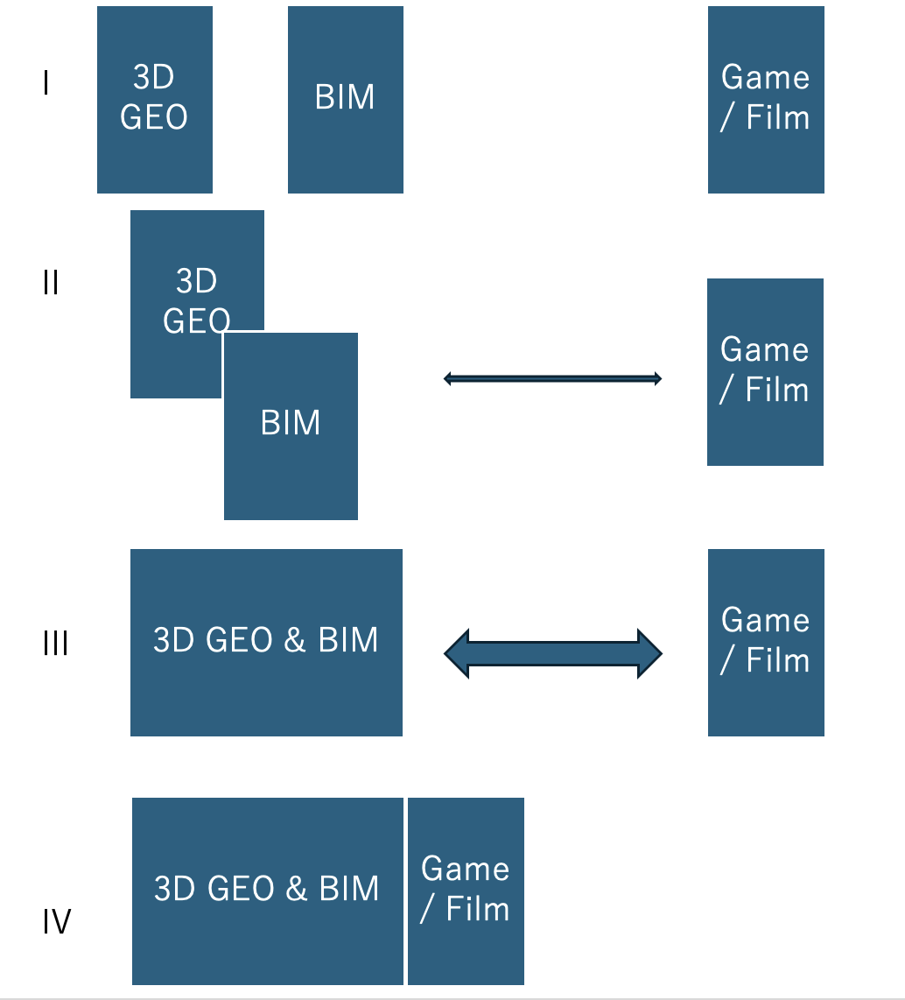
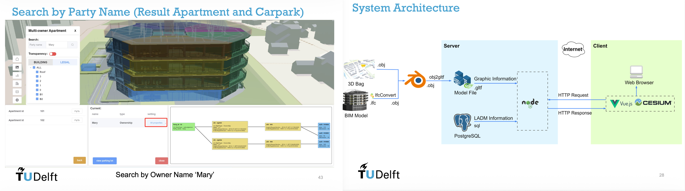

# 2026-07-02
## Summary of Works
- **Topic 1: plateau2cityjson**
  - Updating the PLATEAU-developed cities list [Excel file](https://github.com/tossetolab/TUDelft/blob/88376b9946d5e817b96c8924522ac7c040e7589a/research/PLATEAU-Summary-202603.xlsx)
  - Collecting a list of municipal use-case development projects funded by PLATEAU budget

- **Topic 2: 3D SDI Governance** (→ page 3)
  - Discussing the structure of a writing paper on governance with Bastiaan.
    - Review of previous research and JRC scientific reports for SDI and data space
  - Discussed with Peter van Oosterom regarding BIM data, ISO 19152(LADM) and Point cloud.
  - Participate EuroSDR 3D-GIS for NMCAs online-seminar: [Use cases in Estonia](https://3d.maaruum.ee/kaart/)

---

## Summary of Works

- Others
  - a. Visited to the TUDelft library's collection of historical maps and a meeting with the technical staff (Jules Schoonman)
    - [Allmaps](https://allmaps.org/) project with Martijn Meijers
  - b. [CNG London](https://cloudnativegeo.org/events/cng-london/) related to weather observation and remote sensing analysis.
    - [GeoAI UK](https://iuk-business-connect.org.uk/wp-content/uploads/2026/04/GeoAI-UK-Outlook-Report-Innovate-UK-Business-Connect-April-2026.pdf)
  - c. Visit to UCL-CASA with [Chen Zhong](https://profiles.ucl.ac.uk/46973-chen-zhong) and Pang Yanbo
    - They are considering visit to TUDelft on **2026-09-14** (tentative).

---

## Topic 2: 3D-SDI governance

- There is potential for two papers:
  - **1) Comparative study of 3D-GIS data from NL (+EU) and Japan**
    - From the early SDI research discussed by Masser et al. in the 2000s, to a vision for 3D-SDI towards the future around 2030.
    - The biggest changes in 3D-SDI are the **volume of data (and methods of delivery) and the diversity of stakeholders**.
  - **2) Development of a 3D-SDI assessment framework**
    - Reviewing previous SDI assessments, this paper explores related new technological 3D developments, and how to evaluate the current state of 3D-SDI, particularly its maturity and performance.
    - (PLATEAU) data access, volume, variety(format), development via GitHub.
    - [The 3D city index](https://github.com/binyulei/3D-City-Index) is rather simple and only dataset focused.

---
## 3D-SDI framework

---

## Discussed with Peter van Oosterom regarding BIM and ISO 19152.
- **Digital Triplet concept:** Integration of physical models (e.g., BIM), legal/administrative data, and real-time updates to represent and manage both physical and legal spaces

- Implementation of a standardized legal data model based on ISO 19152 (LADM), enabling consistent representation and integration of ownership.

- Use of point cloud data as alternative to BIM for 3D representation.

 

---

## Use cases in Estonia
- Development 3D viewer by ESRI
  - https://3d.maaruum.ee/kaart/
- [National 3D spatial data strategy (Geo3D)](https://geoportaal.maaamet.ee/eng/spatial-data/geo3d/geo3d-strategy-p835.html) 
  - integrating data **data collection, modelling, sharing, and visualization**, with a roadmap 2026.
 

---

## Next Works

- **Topic 1**
	-  MSc thesis meeting (2026-07-17)
- **Topic 2**
  - Ongoing discussion with Bastiaan (2026-07-08)
  - Appointment & visit for Kadaster (with Bastiaan)
  - Appointment & visit for [Michel Grothe](https://www.geonovum.nl/over-geonovum/wie-wij-zijn/michel-grothe) @ geonovum
- Others
  - Participate FOSS4G-NL (2026-07-09 until 10th July; Terschelling?)
  - Writing for the Japanese GIS-Journal: State of the 3D-GIS in Netherland（2026-08-20）with Hidemichi
  - ***temporal return to Japan: 2026-08-23 to 2026-09-14***
    - Preparing for studio-recorded lectures at the Open University of Japan
