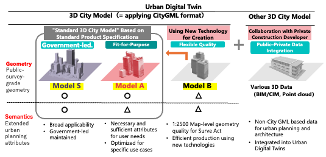

## 2026-08-21

### Summary of Works
- **Topic 1: PLATEAU**
  - PLATEAU’s next 5-years vision has been published by the committee approval.
  - Collected municipal use-case development projects reports (PDF) funded by PLATEAU budgets for four years: 264 projects by 118 municipalities

- **Topic 2: 3D SDI Governance**
  - Developing 3D-SDI maturity assessment framework (v1.5: tentative)
  - Key questions for the key persons interview (v2 : tentative)
  
---

### Summary of Works

- Other works
  - Finished writing for the Japanese GIS-Journal: State of the 3D-GIS in Netherland with Hidemichi
  - Prepared Japanese lecture for 3DBAG developments and Dutch GIS progress.
  - Writing a proposal for the FY2027-FY2030 Japanese research budget for VGI data trust and governance.
  - Management of FOSS4G Hiroshima 2026 Steering & Academic Track
    - Reviewed 93 abstracts, accepted 72 for presentation, and 52 as full papers (ISPRS archives).
    - Over 770 participants registered.

---

### Next works
* Topic 1
  - Support for Kelly's MSc topics: regarding the data and policy context
* Topic 2
  - Progress meeting with Bastiaan (2026-09-21)
  - Visiting for Geonovum with Hidemichi (2026-09-24)
  - Visiting for Dutch SDI committee meeting with Bastiaan (2026-09-25)
* Others
  - from UCL (Prof. Chen Zhong and others) visit TU Delft (2026-09-17)
  - UCL-CASA and Univ. Tokyo-CSIS Joint “digital twin” symposium in London (2026-11-25): CSIS offered me the opportunity to present case studies of 3DBAG and PLATEAU.
* Tasks in Japan (until 2026-09-13)

---

## PLATEAU vision 2026

1. *Data Development and Updating Efficiency*
AI, satellite imagery, and flexible specifications to reduce cost and support continuous updating.
2. *Service Implementation*
Move from pilot projects to routine use in urban planning, disaster management, infrastructure, and public administration.
3. *International Expansion*
Transfer Japanese knowledge, contribute to standards, and address urban challenges abroad.

---

## From 3D city models to urban digital twins 

* Before (Vision 2023):
  * Primary focus on CityGML-based 3D City Models for standard product specifications + ADE
* After (Vision 2026):
  * 3D City Models + trying out automated generation methods (BIM/CIM + Point Clouds + Satellite-derived Models + Other 3D spatial data)
  * Necessary and sufficient quality for primary use cases

